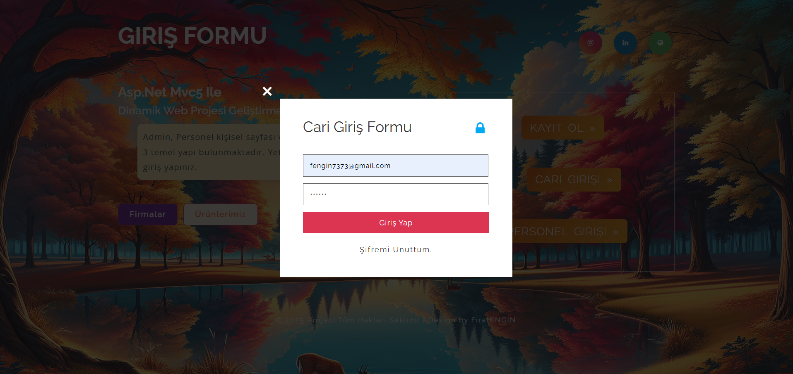
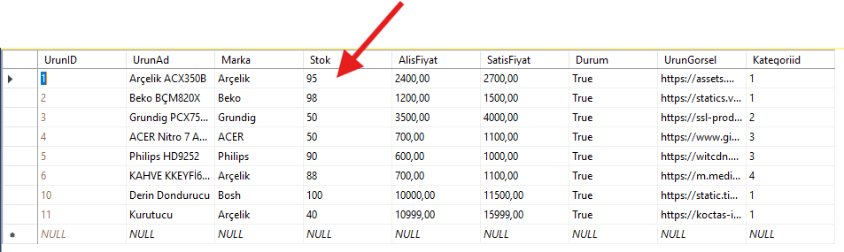
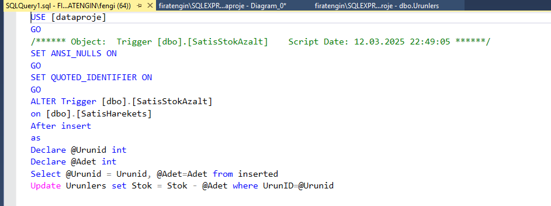

# Asp.Net MVC5 ile Online Ticari Otomasyon

Bu proje, bir mağazanın **Cari** ve **Admin** olmak üzere 2 temel panelinden oluşuyor. Özellikle admin panelinin **dashboard** kısmı ile güçlü bir arayüz tasarımı ve CRUD 
işlemlerinin ötesinde, **Entity Framework**, **LINQ** sorguları üzerinden **Trigger**, **Procedure** gibi SQL yapılarıyla somut bir proje geliştirdim.

## 📝 Proje Özellikleri:
- **Linq Sorguları** 🔍
- **Entity Framework Sorguları** 🛠️
- **İlişkili Tablolar** 🔗
- **Trigger Kullanımı** ⚡
- **Prosedür Oluşturma** 📝
- **Bootstrap Yapısı** 🖥️
- **Dashboard Yapısı** 📊
- **Chart** 📈
- **Widget Cards Kullanımları** 📋
- **Partial View** 📄
- **Code First** 🔧
- **Entity Framework** 📦

---

## 📸 Proje Görselleri:

### Diyagram

### Login Paneli

### 1. Login Ekranı

### Cari Paneli

### Duyuru Ekranı

### Ayarlar Ekranı

### Gelen Kutusu

### Mail Gönderme Ekranı

### Mail Gönderim Sonrası

### Kargo Detayı

### Kargo Takip

### QR Takip

### Satış

### Stok Bitim Ekranı

### Satış Sonrası 2

### Stok Azaltma

### Kategori

### Departmanlar

### Cari Liste

### Cari Satışlar

### Personeller

### Satışlar

### Ürünler

### Faturalar

### Dinamik Fatura

### PDF Doküman

### Ürün Detayı

### Grafik 1

### Grafik 2

### Grafik 3

### İstatistik

### Hızlı Bakış

### Cari Tablosu

### Personel 2

---

