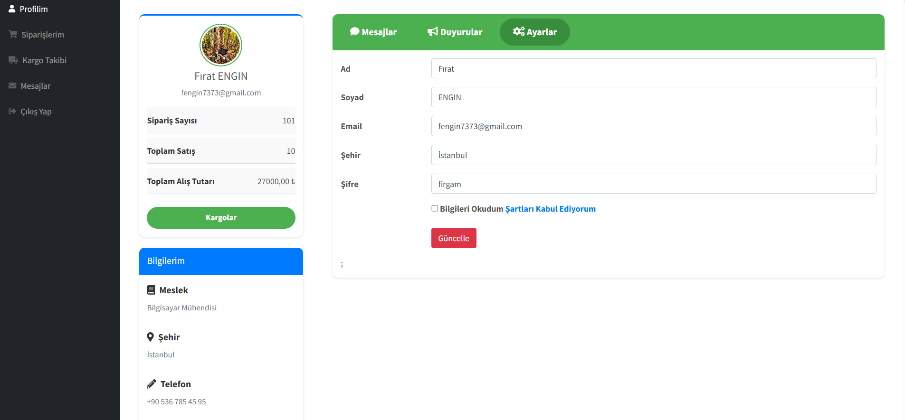
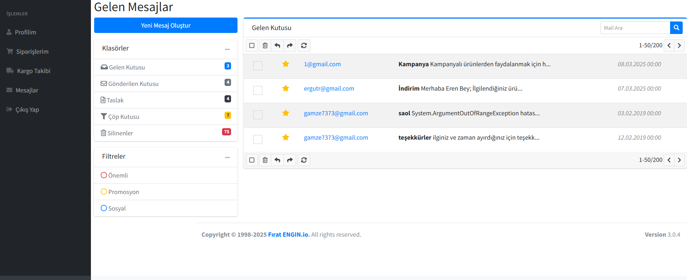
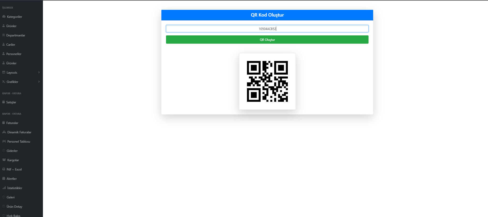
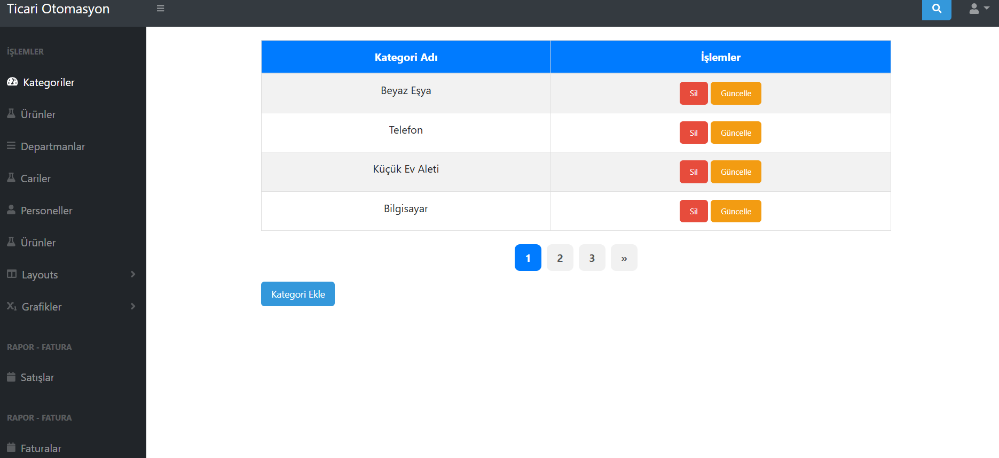
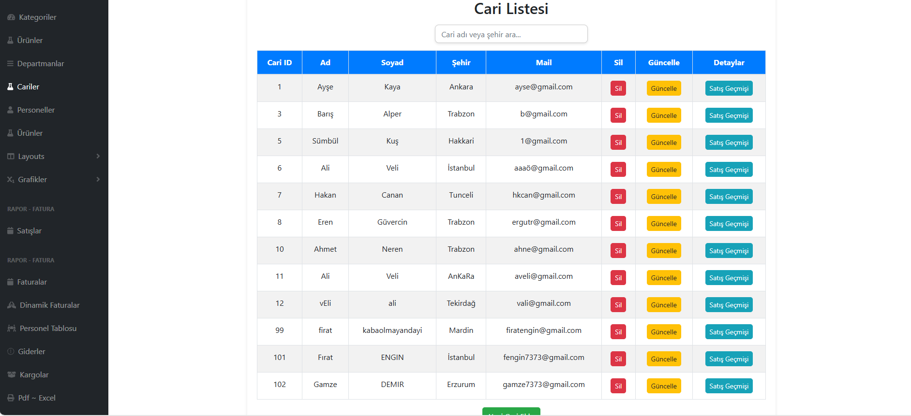
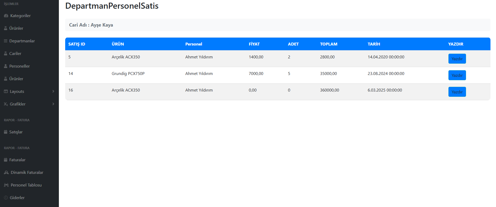
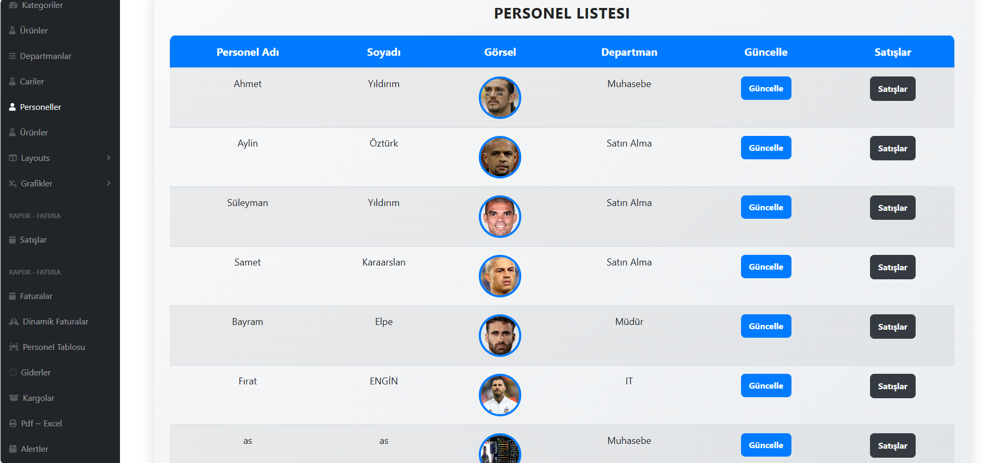
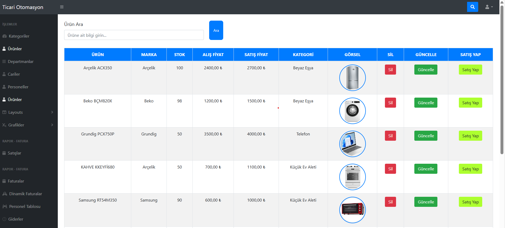
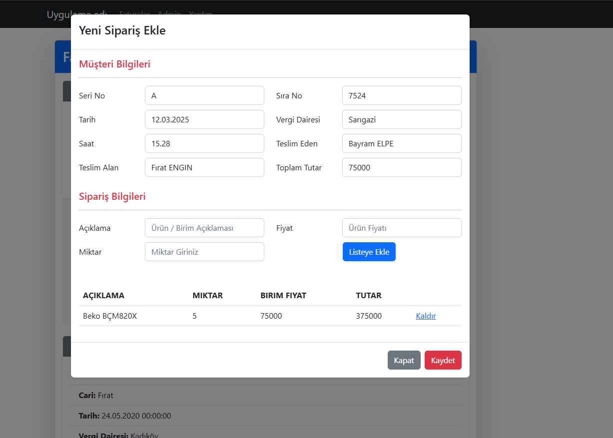
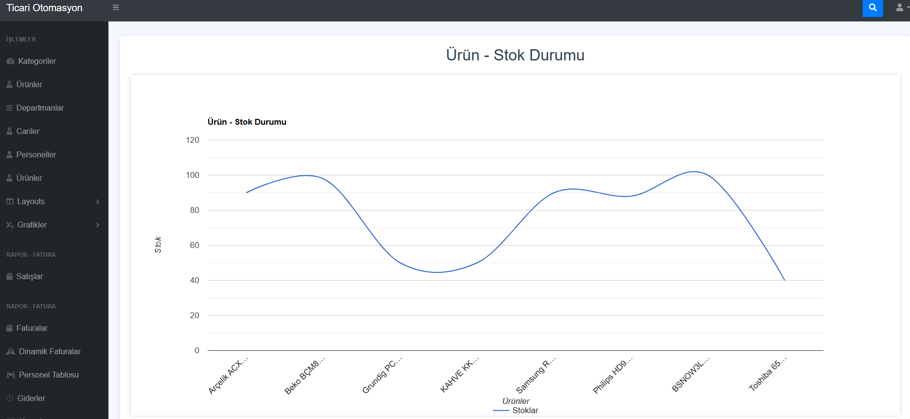

# Asp.Net MVC5 ile Online Ticari Otomasyon

Bu proje, bir mağazanın **Cari** ve **Admin** olmak üzere 2 temel panelinden oluşuyor. Özellikle admin panelinin **dashboard** kısmı ile güçlü bir arayüz tasarımı ve CRUD 
işlemlerinin ötesinde, **Entity Framework**, **LINQ** sorguları üzerinden **Trigger**, **Procedure** gibi SQL yapılarıyla somut bir proje geliştirdim.

## 📠Proje Özellikleri:
- **Linq Sorguları** ğŸ”
- **Entity Framework Sorguları** 🛠ï¸
- **İlişkili Tablolar** 🔗
- **Trigger Kullanımı** ⚡
- **Prosedür OluÅŸturma** ğŸ“
- **Bootstrap Yapısı** 🖥ï¸
- **Dashboard Yapısı** 📊
- **Chart** 📈
- **Widget Cards Kullanımları** 📋
- **Partial View** 📄
- **Code First** 🔧
- **Entity Framework** 📦

---

## 📸 Proje Görselleri:

---

